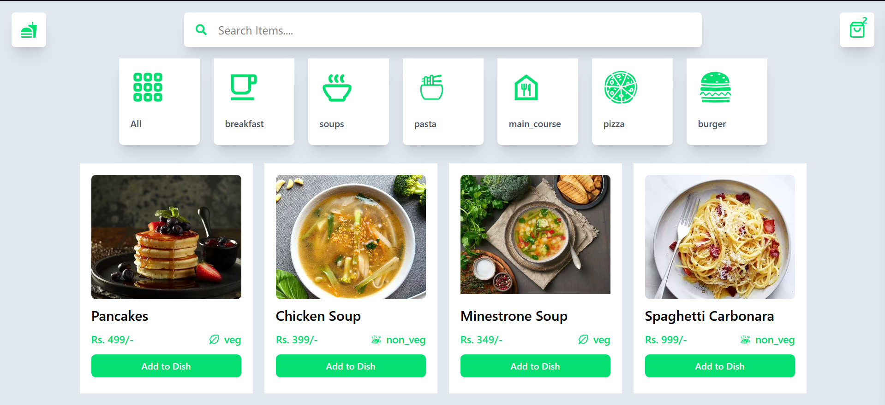
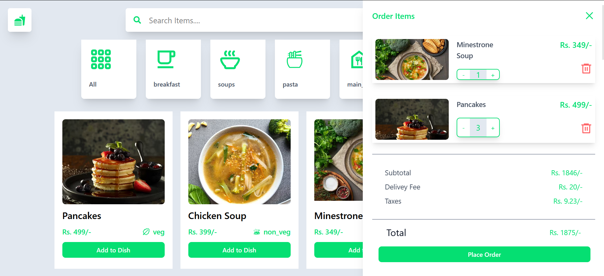

# 🍔 Food Delivery App

🚀 **Food Delivery App** is a modern web application that allows users to browse and order food seamlessly. Built with **React, Context API, and Tailwind CSS**, it offers a smooth and user-friendly experience.

## 🔥 Features
- 🔍 **Search Functionality** – Easily find your favorite dishes.
- 🛒 **Cart System** – Add/remove items from the cart dynamically.
- ⚡ **Real-Time Updates** – Smooth user experience with instant UI updates.
- 🌙 **Dark Mode** – User-friendly theme switching.
- 📦 **Context API for State Management** – Efficient and scalable.
- 📊 **Admin Panel (Optional)** – Manage orders and users.

## 🚀 Tech Stack
- **Frontend:** React.js, Vite, Tailwind CSS
- **State Management:** Context API, Redux Toolkit


## 📸 Screenshots


*(Include relevant screenshots of your app.)*

## 🛠️ Installation

### 1️⃣ Clone the Repository
```sh
git clone https://github.com/Aditya07771/Food-Delivery-App.git
```

### 2️⃣ Navigate to the Project Directory
```sh
cd Food-Delivery-App
```

## 3️⃣ Install Dependencies
```sh
npm install
```

## 4️⃣ Start the Development Server
```sh
npm run dev
```

### 📝 Usage

    Search for your favourite food items 
    Add them to your cart and proceed to checkout.
    Experience a smooth and fast food ordering experience.
    Note - The app should now be running at http://localhost:5173.

### 👨‍💻 Author

**Developer** -Aditya Nishad

### 📜 License

This project is licensed under the MIT License – feel free to use and modify it.


